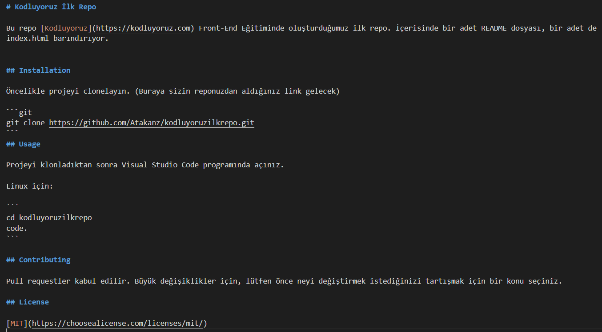

# Kodluyoruz İlk Repo

Bu repo [Kodluyoruz](https://kodluyoruz.com) Front-End Eğitiminde oluşturduğumuz ilk repo. İçerisinde bir adet README dosyası, bir adet de index.html barındırıyor.



## Installation

Öncelikle projeyi clonelayın. (Buraya sizin reponuzdan aldığınız link gelecek)

```git
git clone https://github.com/Atakanz/kodluyoruzilkrepo.git
```
## Usage

Projeyi klonladıktan sonra Visual Studio Code programında açınız.

Linux için:

```
cd kodluyoruzilkrepo
code.
```

## Contributing

Pull requestler kabul edilir. Büyük değişiklikler için, lütfen önce neyi değiştirmek istediğinizi tartışmak için bir konu seçiniz.

## License

[MIT](https://choosealicense.com/licenses/mit/)

Patika profil linki:
```
https://app.patika.dev/atakanzerafet
```